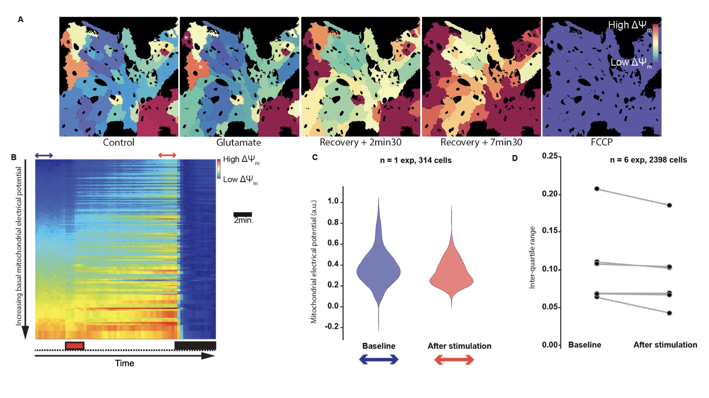
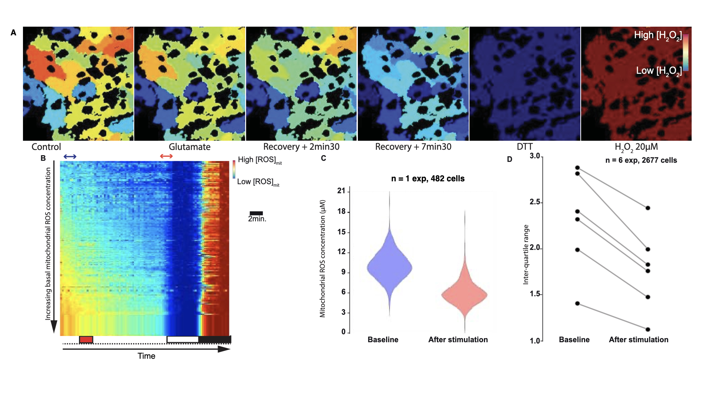

# Cell-to-cell-Heterogeneity

 *Translate raw imaging data into statistical analysis of cell-to-cell heterogeneity of a cellular population*

## Biological background

Cells are located in a dynamically changing environment characterized by spatio-temporel gradients of signaling molecules and physico-chemical constraints. Therefore, cells exhibit dramatically different shapes and metabolic activities. A striking example of the shape diversity of cells is for instance the dendritic arborization of neurons. Like trees, no one is the same as the others.

In this work, we have investigated if non-neuronal cells called astrocytes produce cellular energy ([ATP](https://en.wikipedia.org/wiki/Adenosine_triphosphate) or Adenosine TriPhosphate) using the same metabolic pathways. For simplification, we considered only two of the most important metabolic pathways producing energy in cells: [glycolysis](https://en.wikipedia.org/wiki/Glycolysis) and [mitochondrial oxydative phosphorylation](https://en.wikipedia.org/wiki/Oxidative_phosphorylation). Therefore, we addressed if in a population of astrocytes, they all produce energy using the same metabolic pathways:

**Figure 1**: Rationale of the cell-to-cell heterogeneity study.

## Methods

*Foreword: The goal of this repository is to illustrate how to convert raw imaging data, containing hundreds of cells, into calibrated data that can be stastically studied. The biological relevance is not discussed.*

We monitored, using widefield fluorescence microscopy, several metabolic parameters in intact living astrocytes in several fields of view (**Fig. 2A**) and challenged by a transient stimulation using Glutamate, a molecule released by most of the excitatory neurons (**Fig.2B**). To identify and normalize or calibrate individual individual, you need to acquire at least two channels: 1) The fluorescence biosensor channel(s) and 2) A spectrally separable probe for the nuclei. In this study, we used a far-red dye for living cells. An automated image analysis pipeline (described below) enabled for the time-resolved quantification of energy metabolism parameters at the single-cell level (**Fig.2C**). 

**Figure 2**: (**A**) Up to six fields of view are monitored per field of view, corresponding 250 to 1000 astrocytes per experiment. (**B**) Summary of experimental settings to evaluate the effect of glutamate on energy metabolism in cultured astrocytes. The same protocol was used for all experiments: after a baseline recording, astrocytes were stimulated 2min with Glutamate (200µM) and recovering was monitored. The parameter-specific normalisation condition was then applied. (**C**) Analysis pipeline to infer sorted calibrated intensity plots from raw image data. For data visualisation, cells are sorted according to basal value (y axis) and the normalised intensity is color-coded and displayed along the time (x axis).

## Results

We found that, at resting state, astrocytes are heterogeneous in cellular ATP level, mitochondrial electrical potential and mitochondrial reactive oxygen species (ROS) concentration. A transient stimulation of astrocytes with the neurotransmitter glutamate induced a change in the variability in energy metabolism, characterized by a persistent, calcium-independent, decrease in the variability of cellular ATP level (**Fig. 3** and **4**), mitochondrial electrical potential and mitochondrial ROS concentration (**Fig. 6**).

**Figure 3**: (**A**) Representation of relative ATP level measured using the Magnesium Green method and using metabolic inhibitor as a normalizing condition. (**B**) Color-coded representation of single cell dynamics. (**C**) Representative experiment and (**D**) whole dataset representation of variability index (interquartile range).

**Figure 4**: (**A**) Representation of the normalized ATP level and cytosolic calcium concentration measured using the Magnesium Green method imaged in cells simultaneously labeled with Fura-2. (**B**) Color-coded representation and (**B’**) cross correlation coefficients of single cell dynamics. (**C**) Representative experiment and (D) whole dataset representation of variability index.

**Figure 5**: (**5**) Representation of mitochondrial electrical potential measured using the Rhodamine 123 chemical dye and using the mitochondrial uncoupler as a normalizing condition. (**B**) Color-coded representation of single cell dynamic. (**C**) Representative experiment and (**D**) whole dataset representation of variability index. In our dataset, glutamate did not systematically lead to a significant decrease in cell-to-cell variability.

**Figure 6**: (**A**) Representation of mitochondrial ROS concentration level measured using mito-roGFP2-Orp1 and using metabolic inhibitor as a normalizing condition. (**B**) Color-coded representation of single cell dynamics. (**C**) Representative experiment and (**D**) whole dataset representation of variability index.

## Outlook

Glutamate was found to statistically decrease the variability in energy metabolism in astrocytes *in vitro*.
Together, our results suggest that astrocytes organize in clusters of metabolically heterogeneous cells, thereby generating an apparent stochasticity in the energy metabolism that can be regulated by the neurotransmitter glutamate. An attracting hypothesis from this work would be that the change in metabolic heterogeneity aims to prime the surrounding astrocytes to support more rapidly a next neuronal activity.

## Code

Prerequisite: 

## Acknowledgments

Haissa de Castro Abrantes (University of Lausanne) has prepared and maintained the culture of mouse cortical astrocytes. Critical inputs on the experimental design of the study were provided by Bruno Weber (University of Zurich) and Jean-Yves Chatton (University of Lausanne). This work was supported by SystemsX.ch.

For more information, please contact Guillaume Azarias (guillaume.azarias@hotmail.com)