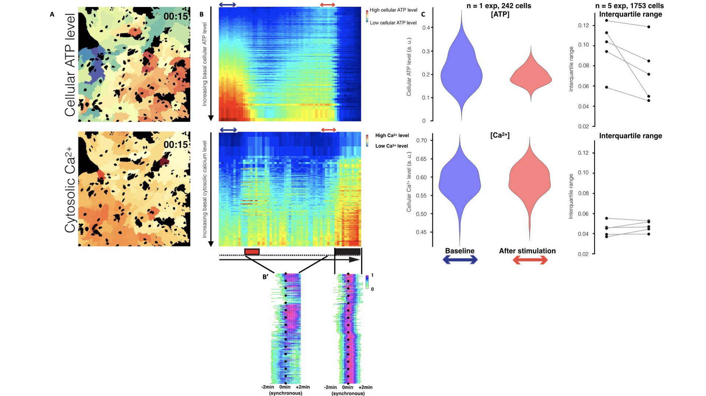
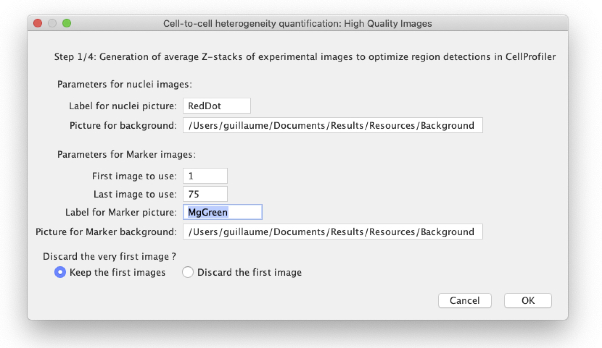
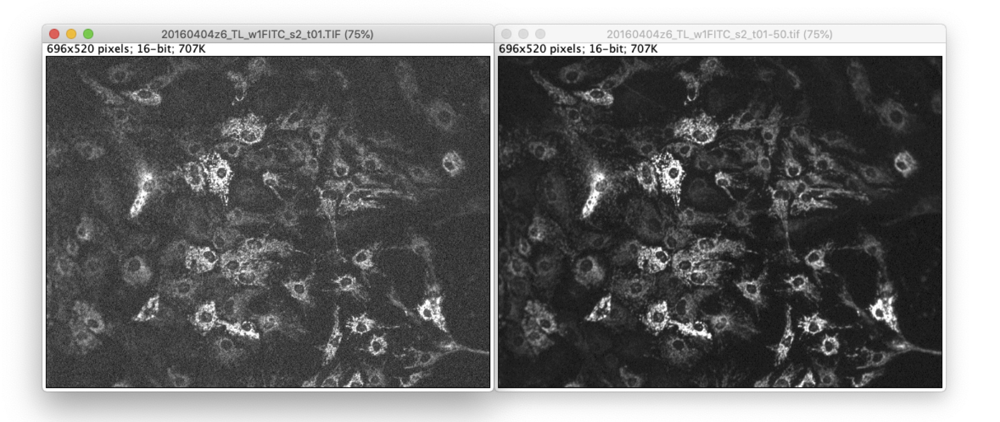
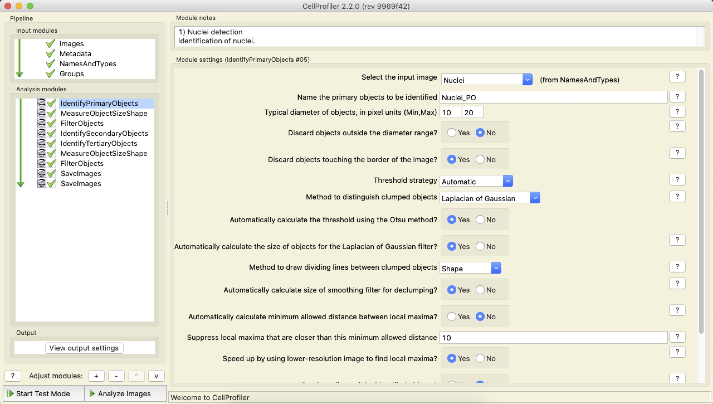
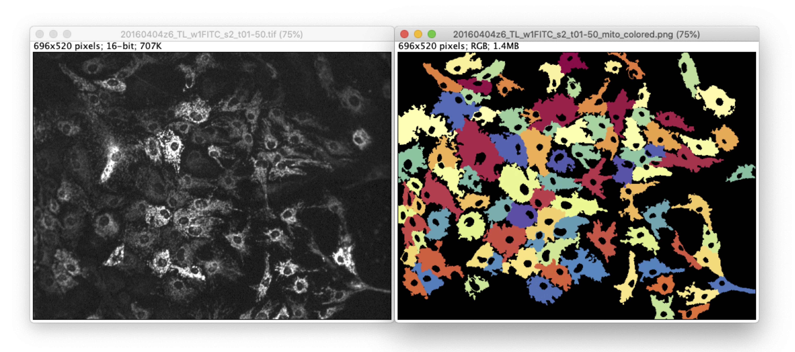
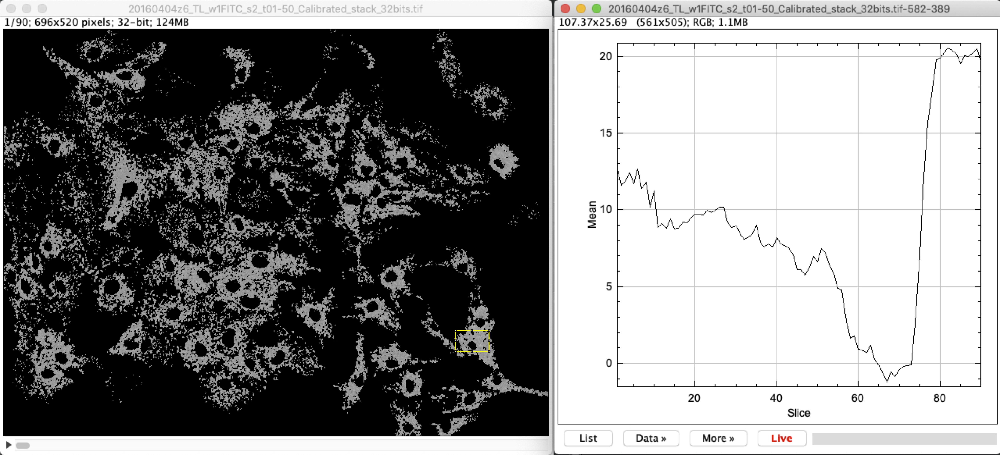

# Cell-to-cell-Heterogeneity

 *Translate raw imaging data into statistical analysis of cell-to-cell heterogeneity of a cellular population*

## Biological background

Cells are located in a dynamically changing environment characterized by spatio-temporel gradients of signaling molecules and physico-chemical constraints. Therefore, cells exhibit dramatically different shapes and metabolic activities. A striking example of the shape diversity of cells is for instance the dendritic arborization of neurons. Like trees, no one is the same as the others.

In this work, we have investigated if non-neuronal cells called astrocytes produce cellular energy ([ATP](https://en.wikipedia.org/wiki/Adenosine_triphosphate) or Adenosine TriPhosphate) using the same metabolic pathways. For simplification, we considered only two of the most important metabolic pathways producing energy in cells: [glycolysis](https://en.wikipedia.org/wiki/Glycolysis) and [mitochondrial oxydative phosphorylation](https://en.wikipedia.org/wiki/Oxidative_phosphorylation). Therefore, we addressed if in a population of astrocytes, they all produce energy using the same metabolic pathways:

**Figure 1**: Rationale of the cell-to-cell heterogeneity study.

## Methods

*Foreword: The goal of this repository is to illustrate how to convert raw imaging data, containing hundreds of cells, into calibrated data that can be statistically studied. The biological relevance is only briefly discussed.*

We monitored, using widefield fluorescence microscopy, several metabolic parameters in intact living astrocytes in several fields of view (**Fig. 2A**) and challenged by a transient stimulation using Glutamate, a molecule released by most of the excitatory neurons (**Fig.2B**). To identify and normalize or calibrate individual individual, you need to acquire at least two channels: 1) The fluorescence biosensor channel(s) and 2) A spectrally separable probe for the nuclei (in this study, we used a far-red dye for living cells). In addition, we used a parameter specific normalisation condition to be able to compare cells between each other.

**Figure 2**: (**A**) Up to six fields of view are monitored per field of view, corresponding 250 to 1000 astrocytes per experiment. (**B**) Summary of experimental settings to evaluate the effect of glutamate on energy metabolism in cultured astrocytes. The same protocol was used for all experiments: after a baseline recording, astrocytes were stimulated 2min with Glutamate (200µM) and recovering was monitored. The parameter-specific normalisation condition was then applied.

## Results
### Summary

We found that, at resting state, astrocytes are heterogeneous in cellular ATP level, mitochondrial electrical potential and mitochondrial reactive oxygen species (ROS) concentration. A transient stimulation of astrocytes with the neurotransmitter glutamate induced a change in the variability in energy metabolism, characterized by a persistent, calcium-independent, decrease in the variability of cellular ATP level (**Fig. 3** and **4**), mitochondrial electrical potential (**Fig. 5**) and mitochondrial ROS concentration (**Fig. 6**).

### Glutamate decreases the variability in cellular ATP content

**Figure 3**: (**A**) Representation of relative ATP level measured using the Magnesium Green method and using metabolic inhibitor as a normalizing condition. (**B**) Color-coded representation of single cell dynamics. (**C**) Representative experiment and (**D**) whole dataset representation of variability index (interquartile range).

### Glutamate does not decrease the variability in cytosolic calcium concentration

**Figure 4**: (**A**) Representation of the normalized ATP level and cytosolic calcium concentration measured using the Magnesium Green method imaged in cells simultaneously labeled with Fura-2. (**B**) Color-coded representation and (**B’**) cross correlation coefficients of single cell dynamics. (**C**) Representative experiment and (D) whole dataset representation of variability index.

### Glutamate decreases the variability in mitochondrial electrical potential

**Figure 5**: (**5**) Representation of mitochondrial electrical potential measured using the Rhodamine 123 chemical dye and using the mitochondrial uncoupler as a normalizing condition. (**B**) Color-coded representation of single cell dynamic. (**C**) Representative experiment and (**D**) whole dataset representation of variability index. In our dataset, glutamate did not systematically lead to a significant decrease in cell-to-cell variability.

### Glutamate decreases the variability in mitochondrial Reactive Oxygen Species concentration

**Figure 6**: (**A**) Representation of mitochondrial ROS concentration level measured using mito-roGFP2-Orp1 and using metabolic inhibitor as a normalizing condition. (**B**) Color-coded representation of single cell dynamics. (**C**) Representative experiment and (**D**) whole dataset representation of variability index.

## Outlook

Glutamate was found to statistically decrease the variability in energy metabolism in astrocytes *in vitro*.
Together, our results suggest that astrocytes organize in clusters of metabolically heterogeneous cells, thereby generating an apparent stochasticity in the energy metabolism that can be regulated by the neurotransmitter glutamate. An attracting hypothesis from this work would be that the change in metabolic heterogeneity aims to prime the surrounding astrocytes to support more rapidly a next neuronal activity.

## Code

### Workflow

The Figure 7 illustrates the analysis pipeline to infer sorted calibrated intensity plots from raw image data. For data visualisation, cells are sorted according to basal value (y axis) and the normalised intensity is color-coded and displayed along the time (x axis).

**Figure 7**: Analysis pipeline to convert raw imaging data into single-cell calibrated time-series data.

### Prerequisites

Data format: The imaging data were stored as tif files
Data names: Make sure that your data names contain *two-digits numbers* to allow for time series analysis.
Software: The macros were developed on [Fiji](https://fiji.sc/) (version 2.0.0-rc69/1.52p), [CellProfiler](https://cellprofiler.org/) (version 2.2.0) and [MATLAB](https://www.mathworks.com/products/matlab.html) (version 2017a).

### Processing Macros

You find them in Cell-to-cell-Heterogeneity/Macros/

#### 1 - High quality images for segmentation (Fiji / ImageJ)

- Input: Image series of baseline recording (normalized names) and fluorescence background images

- Processing steps:
	- Background subtraction
	- Motion correction
	- z-stack of fluorescent dye

- Output: Single high quality image for cell segmentation

- Example:

*Example of segmentation result: Single image (left) and  high quality image (right)*

#### 2 - Cell segmentation (CellProfiler)

- Input: Single high quality image + nuclear staining image

- Processing steps: Segmentation of high quality image based on nuclear staining. Note that you have to adapt the detection parameter to your own data.

- Output: Segmented cells coordinates

- Example:

*Example of segmentation result: Original high quality image (left) and cell segmentation results in arbitrary colors (right)*

#### 3 - Generation of normalized images (Fiji / ImageJ)

- Input: Image series of raw data (time point of normalization step)

- Processing steps:
	- Motion correction (*optional*)
	- Generation of a mask from the cell segmentation result
	- Calculation of pixel values according to the image processing mode:
        * Calibration according to known pixel values (0 and 20µM of H2O2)
        * Normalization to a specific condition (example: no ATP level, no mitochondrial electrical potential)
        * Ratio between two images
	- Filtering of pixels of aberrant value (user-defined using a live graphical user interface)
	- Generation of a stack containing the normalized data and cell coordinates

- Two outputs:
	- Composite stack containing the raw image containing in the red channel and cell segmentation results and in the green channel. The pixel values are the same as the raw images, since the single-cell calibration will be processed later in Matlab.
	- Stack of calibrated cells for data exploration. The pixel value is calibrated according to the lower and higher calibration points. In the shown example, a region of interest was drawn around a cell and the time course of the experiment could be shown using the Plot Z-axis profile in Fiji. The live function allowed to move the region of interest to rapidly show the specific time course of different cells.

- Example:

*Example of composite stack to be further processed by CellProfiler.*

*Example of calibrated stack. The experimental protocol was the following: baseline (images 1-8), glutamate stimulation (images 9-16), recovery (images 17-50), H2O2 depletion (images 50-70), H2O2 20µM (images 71-90).

#### 4 - Measuring the normalized single-cell time course (CellProfiler)

- Input: Normalized image series + segmented cells coordinates

- Processing steps: Measurement of single cell and single time point data

- Output: csv file of time courses and image stack of normalized cell values

### Output Macros

#### 1 - Movie of normalized cell values (Fiji / ImageJ)

- Input: Image stack of normalized cell values

- Processing steps: Creation of a movie from CellProfiler image data

- Output: Movie of normalized cell values (time series)

#### 2 - Graphics of single cell values (MATLAB)

- Input: csv file of time courses from CellProfiler

- Processing steps:
	- Transposition of csv data into a data matrix
	- Graphic representation

- Output: Graphic of single cell normalized values and interquartile range

## Acknowledgments

Haissa de Castro Abrantes (University of Lausanne) has prepared and maintained the culture of mouse cortical astrocytes. Critical inputs on the experimental design of the study were provided by Bruno Weber (University of Zurich) and Jean-Yves Chatton (University of Lausanne). This work was supported by SystemsX.ch.

For more information, please contact Guillaume Azarias (guillaume.azarias@hotmail.com)